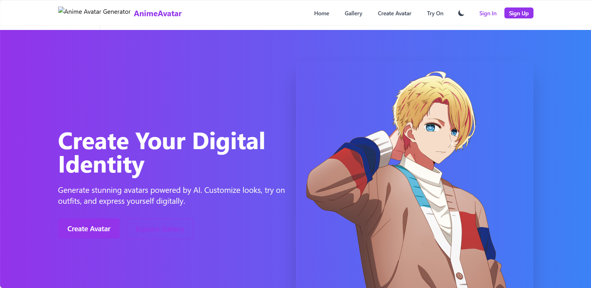
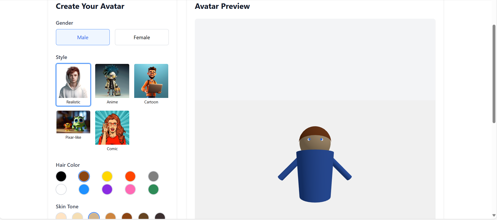
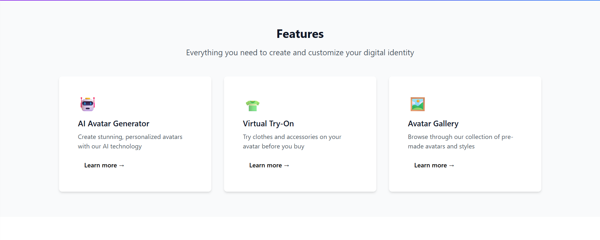
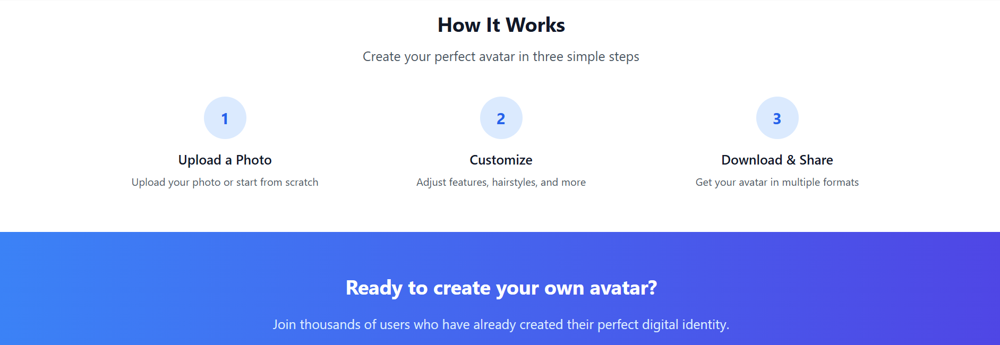

# Shopping-assistant-with-virtual-try-on-
Create stunning, personalized avatars using AI! This project features a modern React + Vite frontend, a Flask backend for AI avatar generation, and a gallery of styles.

## Demo
<p align="center"></p>
<p align="center"></p>
<p align="center"></p>
<p align="center"></p>


---

## Features

- 🎨 Generate avatars in multiple styles (Realistic, Anime, Cartoon, Comic, Pixar, Hero)
- 🧑‍💻 AI-powered avatar creation (using TensorFlow and GANs)
- 👕 Virtual try-on for clothing and accessories
- 🖼️ Avatar gallery and user profiles
- ⚡ Built with React, Vite, TailwindCSS, and Three.js
- 🐍 Flask backend for AI processing

---

## Getting Started

### Prerequisites

- Node.js (v18+ recommended)
- Python 3.8+
- (Optional) CUDA for GPU acceleration

### Installation

#### 1. Clone the repository

```sh
git clone https://github.com/your-username/avatar-generator.git
cd avatar-generator
```

#### 2. Install frontend dependencies

```sh
npm install
```

#### 3. Install backend dependencies

```sh
cd backend
pip install -r requirements.txt
```

#### 4. Start the backend server

```sh
python app.py
```

#### 5. Start the frontend

```sh
cd ..
npm start
```

---

## Project Structure

```
avatar-generator/
├── backend/           # Flask backend (AI avatar generation)
│   ├── app.py
│   ├── model.py
│   └── requirements.txt
├── public/avatars/    # Demo avatar images
├── src/               # React frontend source
│   ├── components/
│   ├── pages/
│   └── ...
├── package.json
└── README.md
```

---

## Technologies Used

- **Frontend:** React, Vite, TailwindCSS, Three.js, face-api.js, framer-motion, GSAP
- **Backend:** Flask, TensorFlow, Pillow, NumPy

---

## Customization

- Add your own avatar styles by placing images in `public/avatars/` and updating the style list in `src/pages/AvatarGenerator.jsx`.
- Update the GAN model path in `backend/model.py` to use your own trained model.

---

## License

MIT

---

## Acknowledgements

- [React](https://react.dev/)
- [Vite](https://vitejs.dev/)
- [TailwindCSS](https://tailwindcss.com/)
- [Three.js](https://threejs.org/)
- [TensorFlow](https://www.tensorflow.org/)
- [Flask](https://flask.palletsprojects.com/)

---

Let me know if you want to add more sections or need help with image hosting for GitHub!

